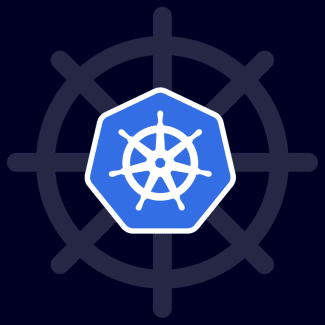

# Comparative Analysis of Tools for Local Kubernetes Cluster Deployment ✨

<p align="center">
  
</p>

## Introduction 

For local development and testing of the software product, three popular tools for deploying Kubernetes clusters are considered in this repository: [minikube](https://minikube.sigs.k8s.io/), [kind](https://kind.sigs.k8s.io/), and [k3d](https://k3d.io/). All these tools allow quick creation of Kubernetes clusters on a local machine for development, testing, and preparing a PoC (Proof of Concept).

## Features 🛠️

| Feature                | [minikube](https://minikube.sigs.k8s.io/) | [kind](https://kind.sigs.k8s.io/) | [k3d](https://k3d.io/) |
|------------------------|------------------|---------------------|--------------------|
| Supported OS           | Linux, macOS, Windows | Linux, macOS, Windows | Linux, macOS, Windows      |
| Supported Architectures| amd64, arm64     | amd64, arm64        | amd64, arm64               |
| Virtualization         | VM, Docker, Podman | Docker, Podman      | Docker                     |
| Automation             | Yes (CLI, API)   | Yes (CLI, API)      | Yes (CLI, API)             |
| Monitoring/GUI         | Dashboard, Addons| No (CLI only)       | No (CLI only)              |
| Ease of Installation   | High             | High                | High                       |
| Documentation          | Excellent        | Excellent           | Excellent                  |
| Community Support      | High             | High                | High                       |
| Docker Alternative     | Podman           | Podman              | Podman v4+ (via Docker API)|

## Advantages and Disadvantages ⚖️

### minikube

| Advantages ✅ | Disadvantages ❌ |
|---|---|
| Supports various drivers (VM, Docker, Podman)<br>Built-in Kubernetes Dashboard<br>Easy to start and configure<br>Supports multiple OS and architectures | Limited scalability (single-node cluster)<br>Relatively slow startup<br>Less suitable for CI/CD scenarios |

### kind

| Advantages ✅ | Disadvantages ❌ |
|---|---|
| Easy to launch multi-node clusters<br>Runs in Docker/Podman containers<br>Well-suited for CI/CD<br>Simple YAML for cluster description | No GUI/additional tools<br>Requires Docker/Podman<br>Fewer monitoring integrations |

### k3d

| Advantages ✅ | Disadvantages ❌ |
|---|---|
| Very fast cluster startup<br>Lightweight, minimal Kubernetes (k3s)<br>Supports multi-node clusters<br>Convenient for PoC and edge scenarios<br>Works with Podman v4+ (via Docker API) | Requires Docker API (Docker or Podman v4+)<br>Fewer extensions and addons<br>Podman support may be less stable than Docker |

## Demonstration (k3d) 🎬

### Example: Deploying a Hello World Application with k3d 🌈

```bash
# Install k3d (Linux)
curl -s https://raw.githubusercontent.com/k3d-io/k3d/main/install.sh | bash

# Create a cluster
k3d cluster create asciiartify-demo --port 8081:80@loadbalancer --kubeconfig-update-default=true

# Check the cluster
kubectl get nodes

# Deploy Hello World (demo page)
kubectl create deployment hello --image=nginxdemos/hello
kubectl expose deployment hello --type=LoadBalancer --port=80

# Get the port
kubectl get svc

# Open in browser (depends on port settings)
http://localhost:8081
```

### Expected output:


### Cleanup
```bash
# Delete deployment
kubectl delete service hello
kubectl delete deployment hello

# Delete the cluster
k3d cluster delete asciiartify-demo
```

More details: [k3d documentation](https://k3d.io/) 📚

## Conclusions and Recommendations 📝

- **minikube** — best suited for initial Kubernetes exploration, has a simple interface and Dashboard, but is limited in scalability.
- **kind** — optimal for CI/CD, testing multi-node clusters, but lacks a GUI and requires Docker/Podman.
- **k3d** — recommended for the AsciiArtify PoC: fast startup, lightweight, supports multi-node clusters, minimal resources, Podman v4+ support via Docker API.

**Recommendation:** For PoC, it is recommended to use **k3d** as the fastest and most convenient tool for local Kubernetes cluster deployment.
